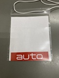
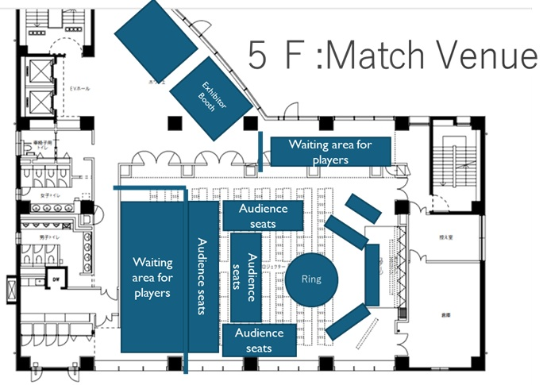

#### robo-one-Light guide(2026.02.25作成)  

# 第28回ROBO-ONE Light 参加者ガイド

## 参加者ガイドについて
このガイドでは、当イベントの参加手順をご紹介します。運営上必要な内容を含めていますので、必ずよくお読みになってご参加ください。また、このガイドは参加証と一緒に印刷して会場に持参していただきますようご協力をお願いします。

### 予選ビーチフラグバトルの集合時間
 3月7日　AM9:00集合
 
（自身の試合スケジュールに合わせてご来場いただいて構いませんが、安全検査、規格審査会場などが混雑している可能性が高いため、お早めにご来場されることをお勧めします。試合に遅れた場合は失格になります。）

### 決勝トーナメントの集合時間
 3月8日 AM9:00 集合

## 会場入場からイベント開始まで
### 受付
集合時間になりましたら建物正面口から入場し、入口から左側の選手控室へお進みください。入口のスタッフに参加証を提示し、タグを受け取ってください。会場内にいる間は参加証を首から下げて移動してください。防犯のため参加証がない方は、選手控室への入室をお断ります。

※参加証は、同伴者も必要です。必ず人数分ご準備ください。参加証をお持ちでない方は会場に入れません。

※人数確認のため、タグを受け取るときはなるべくチームまとめて受け取ってください。

※その場にいる方以外のタグはお渡しできません。

### 参加証の印刷手順
「マイページ」->「エントリー」->「エントリー中の大会」->「参加証印刷」で印刷できます。

※ チーム全員分の印刷をお願いします。

※ ご帰宅の際は、タグは1F選手控室の回収箱にお戻しください。

### 選手控室
選手控室は、1Fと5F（会場内）の2個所ご用意しています。選手控室の席の指定はありませんので空いている席をご利用ください。

・	控室は1テーブルにつき2チームです。

・	ロボットの整備で使用するテーブルタップは各自ご準備下さい。選手控室が広いためできるだけ長めのケーブルをご用意いただくことをお勧めします。

・	昼食は各自ご準備下さい。控室での飲食は可能ですが、ごみは必ず持ち帰るようにご協力をお願いします。

※受付、規格審査は1Fでのみ受け付けていますのでご注意ください。規格審査を通過していないロボットは失格になります。また、5F選手控室には、ご連絡がいきわたらない可能性があります。ご自身で試合の進行を確認しながら待機し、自身の順番5番前ほどになりましたら「選手待機場所」へ移動してください。

※5Fの選手控室はイベント会場に併設しています。イベントの運営、配信に影響がないように大声、大きな音を発しないようにご協力ください。ご協力いただけない場合は、退場していただく場合があります。

※防犯の都合により、お荷物のお預かりはしていません。

※本大会は予想を上回る多くの方にご参加いただいております。選手控室、競技会場が混雑する可能性がありますが、譲り合ってご利用ください。また、残念ながら決勝トーナメントへ出場できなかった場合は、なるべく荷物を整理し、混雑の緩和にご協力をお願い致します。時間を守り運営にご協力お願いします。

### 入金完了の処理のお願い
参加費をお振込み頂いた方は、マイページより「入金終了の処理」を必ず行ってください。処理いただかない場合は、入金確認ができない場合がありますのでご協力をお願いします。
「入金完了連絡」ボタンを押すと「入金確認中」に代わり、管理者が確認ボタンを押したら「入金確認済み」に代わります。
シード選手の請求に関しては、シードに設定されると「請求はありません。」と表示されます。

※本大会は、受付がありませんので参加費のお支払いは必ず事前にお振込みください。お支払いについてのご相談は、下記のお問合せページよりご連絡ください。

### 領収書が必要な場合
参加費の領収書が必要な場合は、事前にご指定の「お宛名」「金額」「但書」を当協会へご連絡ください。

二足歩行ロボット協会　お問い合わせ先　https://www.robo-one.com/contacts/

### 予選ビーチフラグバトル参加概要
__予選ビーチフラグバトルは出場順リストの番号順に4体ずつ実施します。棄権ロボットが出た場合は繰り上げとします。
参加者は予選出場前に安全検査のみを受けてください。規格審査は予選勝者のみ実施します。__

__参加者多数の為、敗者復活戦は実施いたしません。__

__予選ビーチフラグバトル勝者が規格審査に落ちた場合は、その場で失格となり、残りのロボットにより対戦しその勝者が予選通過となります。対戦相手をお呼び出しする可能性がありますので、負けてしまった場合でもすべての試合が終わるまでは会場内に待機してください。再試合はすべての試合が終了した後に実施します。__

__再試合の選手はマイページの通信欄に掲載します。__
https://www.robo-one.com/roboones/realtime_t/82

### 予選ビーチフラグバトル出場順リストに自分のロボットがない場合
予選ビーチフラグバトル対戦順リストは、ウェブサイトにて事前に公開します。(認定大会が3月1日まで開催されていますので公開は3月3日までに公開します。)　こちらに自分のロボットが掲載されていない場合は、イベント開催日前に当協会へご連絡をお願いします。なおランキング三位までのロボットおよび認定権を取得しているロボットは予選ビーチフラグバトルには参加できません。
決勝トーナメント表は、予選ビーチフラグバトル終了後に公開されます。

### 表彰式へご参加ください
成績の良かった上位三位の他、技術賞、協賛企業賞の発表も行いますので、会場にお越しください。表彰式は二日目の最後に実施します。

### 注意

※	会場内で審査が通っていないバッテリーの使用を禁止します。充電も禁止です。不良バッテリーは持ち込まないようにお願いします。

※	バッテリーの管理には十分にご注意ください。充電中は必ずチームのメンバーが管理し、全員が席を離れる場合は充電を停止してから離れてください。管理ができる範囲で、バッテリーをご持参ください。

※	バッテリーは必ず専用のセーフティバッグに入れて持ち運んでください。

※	控室のテーブルは、会場からお借りしているものですので傷つけないようにマットなどを敷いてご利用ください。

### 安全検査（バッテリー審査、他）【重要】
3月8日は試合開始前に「安全検査」を実施します。安全検査は、9:00より1F選手控室内にある規格審査の会場で受け付けます。安全検査を受けていない選手は試合に出場できません。詳しくは競技規則P.5の「安全検査」に関する項目をご確認ください。安全検査は規格審査とは別になりますのでご注意ください。規格審査については下記の内容をご確認ください。

#### バッテリー審査について
安全管理のため、会場内で使用するすべてのバッテリーを審査します。「過度に膨らんでいる」「本体、及びケーブルの被膜が破損している」「コネクタが外れかかっている」など危険と判断されたバッテリーは会場内で使用できません。審査を通過したバッテリーは「BATTERY CHECK OK」シールを貼り付けます。このシールはイベントが終了するまで剥がさないようにお願いします。

予選開始前に持参した全てのバッテリーに対して審査を受けてください。バッテリー審査は規格審査と同じ場所で受け付けます。審査を受けていないバッテリーを使用することはできませんので、バッテリー審査を受けないと予選に参加できません。ご注意ください。
 
 

※これまで貼ってあるバッテリー審査シールはすべてはがしてお持ちください。

※スケジュールの都合により、バッテリー審査と同時に規格審査を受けることはできません。ご了承ください。

## 規格審査
### ＜予選ビーチフラグバトルの規格審査（3月7日）＞
予選ビーチフラグバトルの勝者は、ロボットをお持ちになり、規格審査を受けてください。規格審査の会場は1F選手控室内にあります。
11:00から受付を開始します。予選ビーチフラグバトルの勝者が対象です。

### ＜決勝トーナメントの規格審査（3月8日）＞
9:00になりましたら規格審査の受付を開始します。予選バトルに参加していないシード選手は規格審査を受けてください。同時にバッテリー審査を実施しますので、お手持ちの全てのバッテリーをお持ちください。決勝トーナメント出場権を持っていたとしても、規格審査を通過できない場合は出場できませんのでご注意ください。
※autoでの参加の場合は規格審査にてautoであることを申告しautoシートをもらい参加証に常時入れておいてください。

### 棄権する場合
参加を棄権する場合は、自分の出走順、試合前に必ず規格審査会場のスタッフにご連絡ください。
会場にお越しにならない場合は、お問い合わせフォームからご連絡ください。

二足歩行ロボット協会　お問い合わせ先　https://www.robo-one.com/contacts/

#### 参加者ブリーフィング
今大会では実施しません。

## ＜イベントの進行について＞
### スケジュール
下記のスケジュールで実施します。
### 3月7日(土) ROBO-ONE Light予選ビーチフラグバトル
9:00 参加者入場、準備出来次第規格審査開始(試合1～12)(12以降は10:00より)

10:00 オープニング

10:15 予選ビーチフラグバトル(12試合目まで）

12:00 休憩

13:00 予選ビーチフラグバトル(30試合目まで）

14:30 休憩

15:00 予選ビーチフラグバトル(39試合目まで）

16:00　お楽しみじゃんけん大会/閉会式

16:30 予選終了

### 3月8日(日) ROBO-ONE Light決勝トーナメント
9:00 参加者入場、準備出来次第規格審査開始(シードロボットのみ)

10:00 オープニング

10:15 ROBO-ONE 決勝トーナメント1,2回戦

12:40 休憩

13:30 ROBO-ONE 決勝トーナメント 3回戦まで

14:20 ROBO-ONE 決勝トーナメント 準々決勝/準決勝/３位決定戦/決勝戦

15:20 休憩

15:40 エキシビションマッチ

16:10 お楽しみじゃんけん大会（一般来場者向け）/表彰式

16:40 大会終了

※試合の進行によりスケジュールが前後する場合がありますのでご注意ください。ウェブサイトの情報や中継などで現在の状況を確認しながら待機してください。

※個別の選手誘導はありません。ご自身で進行を確認しながら会場へ移動してください。

会場内では、ロボットや工具を持って走るなど危険な行為は行わないでください。また、エレベーターが混雑する可能性がありますので、余裕をもって試合会場へ移動してください。
 
### 試合の進行状況を確認する方法
ROBO-ONEウェブサイトの各カテゴリー内に「トーナメント」、「結果」ボタンがあります。こちらの内容はリアルタイムで更新されますので、現在の進行を確認することができます。

※試合結果を反映するためには画面の更新が必要です。

__※マイページから試合の進行を見ることができます。__

https://www.robo-one.com/roboones/realtime_t/82

__※緊急の場合はメールをお送りする場合があります。選手登録は会場にて受け取れるメールを登録ください。__

#### ROBO-ONE  Light
　ウェブサイト	https://www.robo-one.com/lights/index/80	 

決勝トーナメントは、予選終了後にROBO-ONEウェブサイトにて公開します。

#### 控室で放送される中継でも進行を確認することができます。
 TwitchのROBO-ONEチャンネルはこちらです。
 
   https://www.twitch.tv/robo_one

ネット環境、機材の状態などにより、結果の更新や配信が遅れることがありますので、余裕をもって会場に移動してください。

機材トラブルなどにより中継が表示できない場合は、スタッフへお声がけください。ただし、配信の復旧を保証するものではありませんので、他の方法でも確認できるようにご準備をお願いします。

各情報の更新、配信トラブルが原因と思われる選手の遅刻に対して運営側は責任を負いません。

### 選手エンタランス
自身の順番の5番程前になりましたら選手待機場所へ移動してください。選手の所在を確認するために、会場への入場口と待機場所が決まっています。以下の会場図に従ってご入場ください。

試合会場

### 注意
三脚を設置しての撮影は禁止です。撮影をする場合は、カメラを手にもって撮影してください。撮影は観覧エリア内で実施してください。

### 発煙、火災など事故が発生した場合
選手控室に防災グッズが用意されています。緊急時は耐熱シートに入れ濡れタオルをかぶせてください。そのままバケツに入れ屋外へ持ち出し消火を確認してください。また、事故が発生したら速やかに近くのスタッフに連絡してください。

### 怪我をした場合
選手控室に救急箱を用意していますのでご利用ください。またご利用後は会場スタッフまでご連絡ください。

### 注意
※ご来場者、参加者の安全のため通路やステージ外、選手控室外でロボットの電源を入れることを禁止します。また、会場観客席でのメンテナンスはご遠慮ください。

### ご来場者様へのお願い
#### 会場内にゴミ箱のご用意はございません。ゴミはすべてお持ち帰りください。
#### 会場内は、ご来場者様、参加者様で混雑している場合がございます。安全のため会場内すべての場所にてロボットを動かすことはご遠慮ください。
#### より多くの方に試合を見ていただくために、三脚を設置しての撮影は禁止です。撮影の際は、お客様の観覧席より手にお持ちになって撮影してください。また、周囲の方の邪魔にならないようにご配慮ください。
#### 審査、運営の妨げになりますので、会場内ではなるべくお静かご観戦いただきますようお願いします。

皆様のご来場を心よりお待ちしております。

